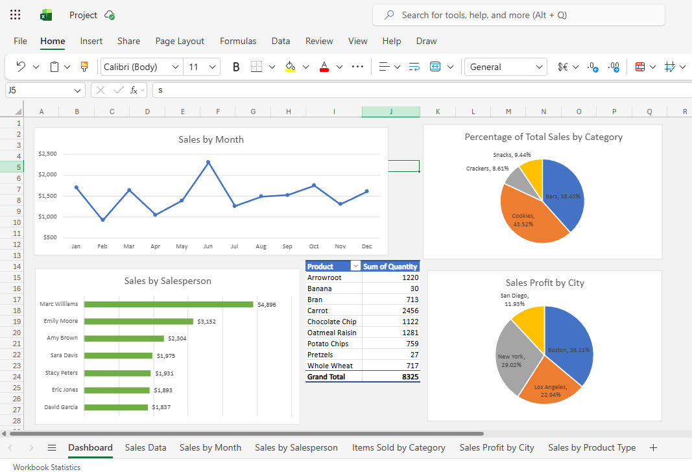

# Sales Performance & Operational Analytics — Excel MIS Dashboard

## 📊 Project Overview

This project demonstrates an end-to-end Management Information System (MIS) data pipeline built entirely within Microsoft Excel. It converts a raw, unorganized flat-file of transactional sales rows into a dynamic, single-page executive dashboard tracking **$17,989** in total revenue across regions, products, salespeople, and time.

## 🗂️ Workbook Structure

| Sheet | Purpose |
|---|---|
| `Dashboard` | Consolidated view of all charts and the product summary table |
| `Sales Data` | Raw transaction table (with a derived `Month` column) |
| `Sales by Month` | PivotTable + line chart of monthly revenue trend |
| `Sales by Salesperson` | PivotTable + bar chart ranking reps by revenue |
| `Items Sold by Category` | PivotTable + pie chart of unit sales share by category |
| `Sales Profit by City` | PivotTable + pie chart of revenue share by city |
| `Sales by Product Type` | PivotTable summary table (quantity by product), embedded in the dashboard |

## 🔄 Data Transformation: From Raw Rows to Executive Insights

**1. The Input (Raw Transactional Data)**
The project started with a raw dataset containing one row per order, with fields for Order Date, Region, City, Category, Product, Quantity, Unit Price, Total Price, and Salesperson.

**2. The Output (Interactive Dashboard Engine)**
Using engineered date fields, PivotTables, and PivotCharts, those rows were compressed into a single gridline-free executive canvas — a uniform-background dashboard sheet combining four charts and one summary table into one view.



## 🛠️ Technical Workflow & Implementation Details

**1. Data Ingestion & Feature Engineering**
Converted the initial range (`A1:I23` and beyond) into a formatted Excel Table with headers, so PivotTables and charts would refresh dynamically as rows are added. Engineered a temporal `Month` dimension in a new column using:
```
=TEXT(A2, "mmm")
```
then filled the formula down the table to extract a three-letter month label from every order date.

**2. Sales by Month**
Built a PivotTable (`TotalPrice` → Values, `Month` → Rows) on a new sheet, *Sales by Month*. Formatted values as currency with 0 decimal places, then inserted a line chart beside the PivotTable. Reset the chart's vertical axis minimum from 0 to 500 to make the monthly trend easier to read.

**3. Sales by Salesperson**
Built a second PivotTable (`TotalPrice` → Values, `Salesperson` → Rows), formatted as currency, sorted largest to smallest. Inserted a clustered bar chart and set the vertical axis categories to display in reverse order, so the top performer appears at the top of the chart.

**4. Items Sold by Category**
Built a PivotTable (`Quantity` → Values, `Category` → Rows) with the value display changed to "% of Grand Total," then visualized as a pie chart showing each category's share of total units sold.

**5. Sales Profit by City**
Built a PivotTable (`TotalPrice` → Values, `City` → Rows) and visualized as a pie chart showing each city's share of total revenue.

**6. Sales by Product Type**
Built a final PivotTable (`Quantity` → Values, `Product` → Rows) on its own sheet, used as a supporting summary table on the dashboard.

**7. Dashboard Assembly**
Created a new sheet, selected the entire sheet (Ctrl+A) and applied a uniform fill color as a clean background, then placed the four charts (Sales by Month, Sales by Salesperson, Items Sold by Category, Sales Profit by City) and a copy of the Sales by Product Type table onto a single executive view.

## 📈 Key Insights

- **Trend:** Monthly revenue ranged from a low of $926 (Feb) to a peak of $2,309 (Jun), with a choppy but generally upward-leaning pattern across the year.
- **Top performer:** Marc Williams led all salespeople with **$4,896** in sales, more than 50% ahead of the second-place rep, Emily Moore ($3,152).
- **Category mix:** Cookies (43.5%) and Bars (38.4%) together account for roughly 82% of all units sold; Crackers and Snacks make up the remainder.
- **Geography:** Boston generated the largest share of profit at **36.1%**, followed by New York (29.0%), Los Angeles (22.9%), and San Diego (11.9%).
- **Top product by volume:** Carrot was the best-selling product at 2,456 units, ahead of Oatmeal Raisin (1,281) and Arrowroot (1,220).

## 🧰 Skills Demonstrated

PivotTables · PivotCharts (line, clustered bar, pie) · calculated date fields (`TEXT` function) · custom number formatting (currency, percentage) · chart axis customization · dashboard design and layout in Excel.

## 📁 Repository Contents

- `Sales_Performance_MIS_Dashboard.xlsx` — full workbook with all sheets, PivotTables, PivotCharts, and the dashboard
- `dashboard_view.png` — screenshot of the final dashboard
- `README.md` — this file
